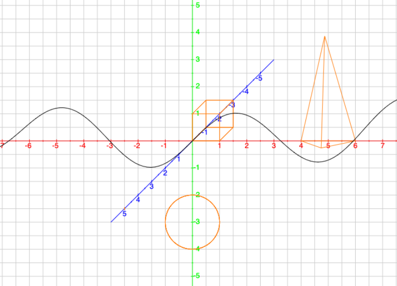
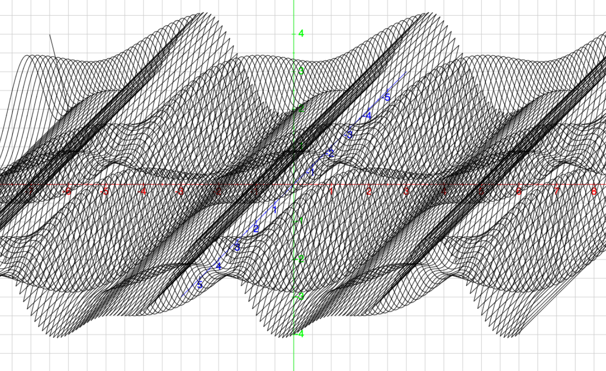

# Math Plotter

A graphing tool which makes plotting objects into a parallel perspective 3D coordinate system simple.

This program can be used to visualize points / objects / vectors like in math schoolbooks.

Developed for an so-called "GFS" (Gleichwertige Feststellung von Schülerleistungen) presentation in math at school.

# Features
-zoom-in, zoom-out, move

-labeled axes

-math notepad like square grid

-labeled vectors, rectangle, circle, cuboid, tetrahedon

-1D-functions, 2D-functions

# Screenshots
Various shapes |  2D function X
:-------------------------:|:-------------------------:
  |  

# Usage
For an example usage refer to https://github.com/yxyx136/2DPlotter/blob/master/Main.js  
(comment out  lines to to see examples for different shapes)

The engine's code is located at https://github.com/yxyx136/2DPlotter/tree/master/engine/script
